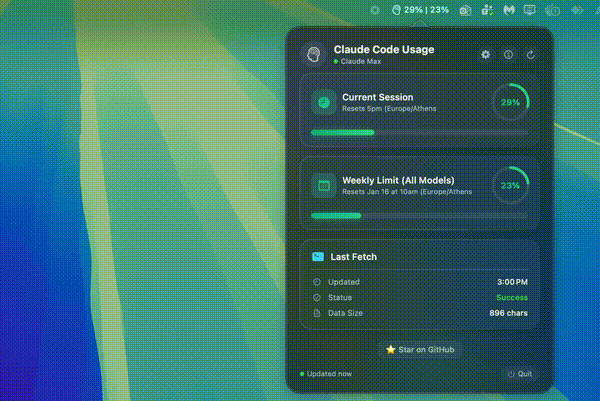

# Claude Code Usage Bar

[](https://www.apple.com/macos/)
[](https://swift.org/)
[](https://www.python.org/)
[](LICENSE)
[](https://optimalversion.io)

> **Note for users downloading from GitHub Releases:** macOS may show a security warning because the app is not signed with an Apple Developer certificate. To bypass this, run the following command after moving the app to Applications:
> ```bash
> xattr -cr /Applications/ClaudeUsageBar.app
> ```

A beautiful macOS menu bar app that displays your **Claude Code** usage statistics in real-time. Monitor your session and weekly limits at a glance with a stunning glassmorphic UI.

<p align="center">
  
</p>

## Features

- **Real-time Usage Tracking** - See your current session and weekly usage percentages directly in the menu bar
- **Dynamic Color Indicators** - Progress bars change from green to yellow to red based on usage
- **Glassmorphic UI** - Beautiful, modern popup with gradient progress bars and glow effects
- **Configurable Auto-refresh** - Set refresh interval from 30 seconds to 10 minutes (or disable)
- **Settings Panel** - Customize refresh behavior through the built-in settings
- **Multiple Model Support** - Tracks usage for all models and Sonnet-specific limits
- **Reset Time Display** - Know exactly when your limits reset
- **Native macOS App** - Built with SwiftUI for optimal performance
- **Zero Token Usage** - Only queries account stats, never uses API tokens

## Requirements

### System Requirements

| Requirement | Version | Notes |
|-------------|---------|-------|
| **macOS** | 13.0 (Ventura) or later | Required for SwiftUI features |
| **Python** | 3.6+ | Usually pre-installed on macOS |
| **Xcode** | 14.0+ | Only needed if building from source |

### Claude Requirements

| Requirement | Description |
|-------------|-------------|
| **Claude Code CLI** | Must be installed and accessible. [Install from claude.ai/code](https://claude.ai/code) |
| **Claude Pro/Max** | Active subscription required (usage limits only apply to paid plans) |
| **Authenticated** | Must be logged into Claude Code CLI (`claude` command should work) |

### Verify Requirements

```bash
# Check Python version
python3 --version

# Check if Claude CLI is installed
which claude

# Test Claude CLI is working
claude --version
```

## Installation

### Option 1: Download Release (Recommended)

1. Download the latest `.app` from [Releases](../../releases)
2. Move `ClaudeUsageBar.app` to your Applications folder
3. Open the app (you may need to right-click → Open the first time due to Gatekeeper)

### Option 2: Build from Source

1. Clone this repository:
   ```bash
   git clone https://github.com/JohnDimou/ClaudeCodeUsageBar.git
   cd ClaudeCodeUsageBar
   ```

2. Open in Xcode:
   ```bash
   open ClaudeUsageBar.xcodeproj
   ```

3. Build and run (⌘+R)

Or build from command line:
```bash
xcodebuild -project ClaudeUsageBar.xcodeproj -scheme ClaudeUsageBar -configuration Release build
```

The built app will be in `~/Library/Developer/Xcode/DerivedData/ClaudeUsageBar-*/Build/Products/Release/`

## Usage

1. **Launch the app** - A brain icon appears in your menu bar with usage percentages
2. **View quick stats** - The menu bar shows session and weekly usage
3. **Click for details** - Opens a popup with full usage information
4. **Configure settings** - Click the gear icon to adjust refresh interval

### Menu Bar Display

```
🧠 25% | 22%
   ↑      ↑
   │      └── Weekly usage (all models)
   └── Current session usage
```

### Color Indicators

| Usage Level | Color | Meaning |
|-------------|-------|---------|
| 0-50% | Green | Plenty of capacity remaining |
| 50-75% | Yellow/Orange | Moderate usage |
| 75-100% | Red | Near or at limit |

## Settings

Access settings by clicking the gear icon in the popup:

| Setting | Options | Default | Description |
|---------|---------|---------|-------------|
| Refresh Interval | 30s, 1m, 2m, 5m, 10m, Never | 1 minute | How often to auto-fetch usage data |
| Refresh on Open | On/Off | On | Fetch fresh data when popup opens |

Settings are persisted and remembered between app restarts.

## How It Works

The app uses a Python script to interact with the Claude Code CLI:

1. Spawns Claude CLI in an interactive pseudo-terminal (pty)
2. Sends the `/usage` slash command
3. Parses the terminal output to extract usage data
4. Displays the results in a native SwiftUI interface

### Important: No Token Usage

**This app does NOT consume any Claude API tokens.** The `/usage` command is a built-in CLI feature that queries your account statistics directly from Anthropic's servers - it does not invoke any AI model. It's equivalent to checking your usage on the Anthropic dashboard.

## Project Structure

```
ClaudeCodeUsageBar/
├── ClaudeUsageBar/
│   ├── ClaudeUsageBarApp.swift    # App entry point & menu bar setup
│   ├── UsageManager.swift          # Usage data fetching, parsing & settings
│   ├── UsagePopoverView.swift      # SwiftUI popup interface & settings panel
│   └── Info.plist                  # App configuration
├── get_claude_usage.py             # Python script for CLI interaction
├── ClaudeUsageBar.xcodeproj/       # Xcode project
├── screenshot.png                  # App screenshot
├── LICENSE                         # MIT License
└── README.md
```

## Troubleshooting

### "Claude CLI not found"
```bash
# Check if Claude is installed
which claude

# If not found, install from:
# https://claude.ai/code

# If installed but not found, it might be in a non-standard path
# The app checks these locations automatically:
# - /usr/local/bin/claude
# - /opt/homebrew/bin/claude
# - ~/.local/bin/claude
# - ~/.npm-global/bin/claude
```

### "Python 3 not found"
```bash
# Check Python version
python3 --version

# If not installed, install via Homebrew:
brew install python3
```

### Usage not updating
- Click the refresh button (circular arrow) in the popup
- Check Settings → ensure refresh interval isn't set to "Never"
- Ensure you have an active Claude Pro/Max subscription
- Verify `claude` works in your terminal

### App won't open (macOS security)
- Right-click the app → Open → Open
- Or: System Settings → Privacy & Security → Open Anyway

### Usage shows 0% for everything
- Make sure you're logged into Claude Code CLI
- Run `claude` in terminal and verify it works
- Check that you have a Pro/Max subscription

## Privacy & Security

- **Local Only** - All data stays on your machine
- **No External Servers** - The app only communicates with the local Claude CLI
- **No Tracking** - No analytics or telemetry
- **Open Source** - Full source code available for review

## Contributing

Contributions are welcome! Please feel free to submit a Pull Request.

1. Fork the repository
2. Create your feature branch (`git checkout -b feature/amazing-feature`)
3. Commit your changes (`git commit -m 'Add amazing feature'`)
4. Push to the branch (`git push origin feature/amazing-feature`)
5. Open a Pull Request

## License

This project is licensed under the MIT License - see the [LICENSE](LICENSE) file for details.

## Author

**John Dimou** - [OptimalVersion.io](https://optimalversion.io)

## Acknowledgments

- Inspired by the need to track Claude usage without constantly running `/usage`

---

<p align="center">
  Made by <a href="https://optimalversion.io">John Dimou - OptimalVersion.io</a>
</p>
